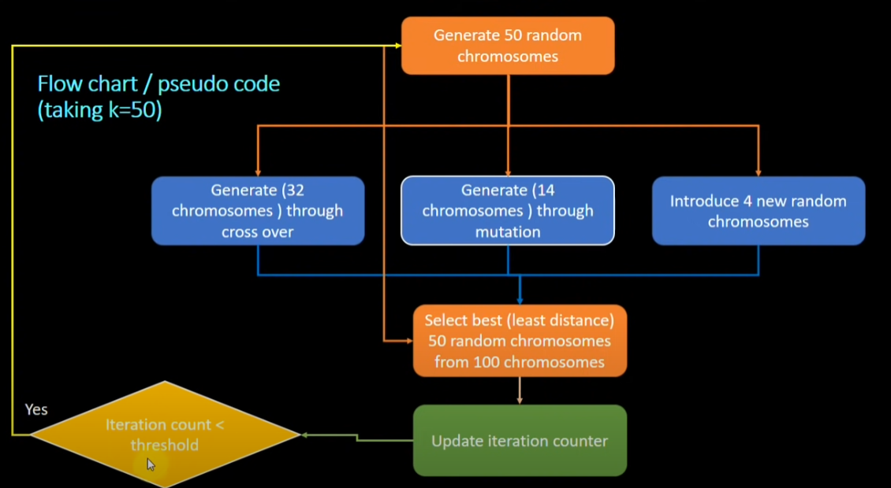

# vrp-challenge
## How to run
```bash
    # install requirements
    pip install -r ./requirements.txt
    cd vrp
    
    # run brute force
    python core.py -s bruteforce
    python core.py -s bruteforce -l -i -v
    python core.py --style bruteforce --limited_capacity --include_service --verbose
    
    # run genetic
    python core.py -s genetic -v
```

### Arguments for core.py
```bash
    -s --style           : [mandatory] Algoritm style. [values: bruteforce, genetic]                 
    -f --filename        : [optional] Input filename. [default: "./input/input.json"]
    -l --limited_capacity: [optional] Use the vehicle capacity values. [optional, default: false]
    -i --include_service : [optional] Use the service durations of the jobs. [optional, default: false]
    -v --verbose         : [optional] Print extra info. [optional, default: false]     
```

## Genetic algorithm
Approach is based on this [video](https://youtu.be/3GAfjE_ChRI) and this [paper](https://www.mdpi.com/2079-9292/10/24/3147/pdf).
